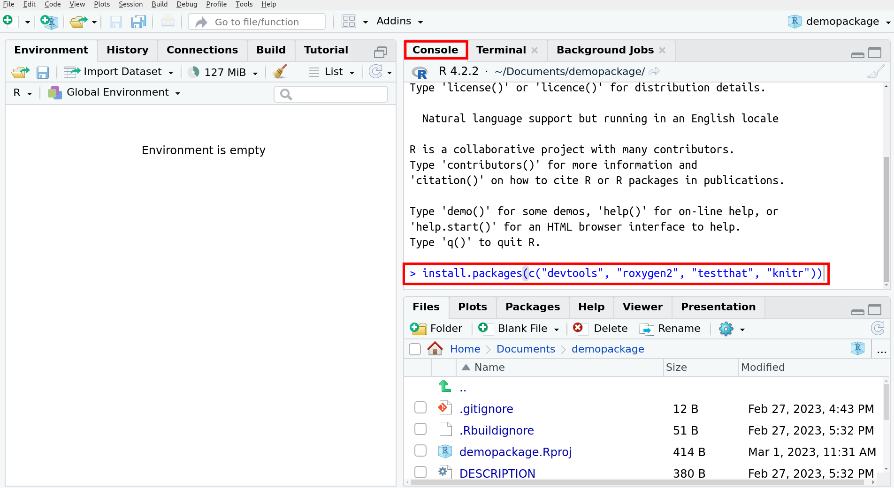

Notes for Wheeler Lab Meeting on 2023-03-03.

# Pre-work (~10 mins)

## 1. Install R

If you already have R, note your version with `R --version` in a terminal or typing `R.version` in an R console (like in RStudio).
If you are getting R for the first time, get version 4.2.2.

**MacOS:** https://cran.rstudio.com/bin/macosx/

**Windows:** https://cran.rstudio.com/bin/windows/base/R-4.2.2-win.exe


## 2. Install RStudio

1. https://posit.co/download/rstudio-desktop/


## 3. Get the R Build toolchain

### Windows

1. Go to \url{https://cran.r-project.org/bin/windows/Rtools/} and begin installing the version that matches your R version
When installing, make sure "Edit the system PATH" is **unchecked** and "Save version information to registry" is **checked**

### MacOS

1. Register as an Apple developer (for free): \url{https://idmsa.apple.com/IDMSWebAuth/signin?appIdKey=891bd3417a7776362562d2197f89480a8547b108fd934911bcbea0110d07f757&path=%2Fregister%2Fagree%2F&rv=1}
2. Open a terminal and type:

```{bash eval = FALSE}
xcode-select --install
```


## 4. Install R packages that help you make R packages

1. Open RStudio
2. Within the console tab, enter: 

```{r eval = FALSE}
install.packages(c("devtools", "roxygen2", "testthat", "knitr"))
```





## 5. Save the data

1. Move the attached `em-data` folder to a location on your laptop that you can find, like "Documents" or "Desktop".
 


\newpage

# If you are new to R

The code is in gray blocks and the output of the code is printed after two '#' symbols.

The data we work with is often formatted as a "dataframe" (a table with column names).

```{r echo = FALSE}
shapes_df <- data.frame(shapes = c("triangle", "square", "pentagon"),
                        sides = c(3, 4, 5))
```


```{r}
shapes_df
```

This dataframe has information about shapes. The row names are 1, 2, 3. The column names are "shapes" and "sides".

We can access a particular column using the $ symbol.

```{r}
shapes_df$sides
```

We can check which values in `shapes_df$sides` are bigger than 4.

```{r}
shapes_df$sides > 4
```

We can access a subset of `shapes_df` with integer or boolean (true/false) indices in square brackets. The syntax is `df[rows, columns]`. Leaving `rows` or `columns` empty means you want to keep all of them.

```{r}
shapes_df[1:2, ]

shapes_df[c(TRUE, FALSE, TRUE), c(TRUE, TRUE)]
```

On the next page is code to find a subset of `shapes_df` where:

1. We keep all the columns
2. We only keep the rows where the number of sides are bigger than 4

```{r}
shapes_df[shapes_df$sides > 4, ]
```
